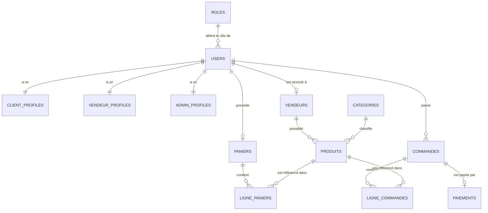

# 🗺️ Guide d'Architecture & Documentation Technique - ArtisanMarket

Ce document décrit en détail le fonctionnement technique de la plateforme **ArtisanMarket**, de la base de données jusqu'aux vues, en passant par les contrôleurs, les routes et la gestion de la sécurité. Il est conçu pour aider les nouveaux développeurs à comprendre et s'approprier le projet rapidement.

---

## 📌 1. Vue d'ensemble du projet

**ArtisanMarket** est une place de marché (marketplace) dédiée aux produits artisanaux. Elle met en relation :
1. **Les Clients** : Qui parcourent les produits, gèrent leur panier, passent des commandes et paient en ligne.
2. **Les Vendeurs** : Qui créent et gèrent leurs boutiques, leurs stocks et leurs produits.
3. **Les Administrateurs (Admin)** : Qui modèrent la plateforme (utilisateurs, vendeurs, produits, commandes).

---

## 🗄️ 2. Schéma de la Base de Données & Migrations

La base de données est structurée pour séparer les comptes utilisateurs de leurs profils spécifiques et pour figer les données d'achat lors de la commande.



### 📋 Description des Tables Clés

*   **`roles`** : Gère les rôles utilisateurs (`client`, `vendeur`, `admin`).
*   **`users`** : Table utilisateur principale Laravel. Contient un `role_id` lié à la table `roles`.
*   **`client_profiles` / `vendeur_profiles` / `admin_profiles`** : Profils de données complémentaires propres à chaque rôle (adresse, téléphone, biographie, etc.), créés dynamiquement via la méthode `syncProfileByRole()` du modèle `User`.
*   **`vendeurs`** : Enregistrement de la boutique du vendeur. Contient le statut d'approbation (`en_attente`, `approuve`, `rejete`).
*   **`produits`** : Liste des articles proposés à la vente. Un produit est rattaché à un `vendeur_id` et une `categorie_id`.
*   **`paniers` & `lignepaniers`** : Gestion persistante du panier d'achat en base de données pour les utilisateurs connectés.
*   **`commandes` & `lignecommandes`** : Représentation historique d'un achat. Lors de la commande, le prix unitaire du produit est **copié** dans `lignecommandes.prix_unitaire` pour éviter que les modifications ultérieures de prix sur le catalogue n'altèrent les factures passées.
*   **`paiements`** : Suivi financier de la commande. Contient les champs de facturation (`numero_facture`, `statut`, `mode_paiement`).

---

## 🔐 3. Authentification & Rôles

Le système d'authentification utilise les routes d'authentification Laravel standard (`Auth::routes()`).

### ➡️ Flux d'inscription
1. L'utilisateur remplit le formulaire d'inscription `/register`.
2. Par défaut, le compte est créé avec le rôle **`client`** et son profil `ClientProfile` associé.
3. Les comptes vendeurs ne peuvent pas être demandés à l'inscription. Si un compte vendeur est requis, il doit être inséré via les seeders de la base de données, ou promu manuellement par un administrateur.
4. L'adresse email doit être vérifiée par lien envoyé par mail avant de pouvoir passer commande (activation du middleware `verified`).

### 🔀 Redirection après connexion (`LoginController`)
Lors de la connexion, le contrôleur inspecte le rôle de l'utilisateur pour le rediriger vers le tableau de bord approprié :
*   `admin` ➔ `/admin/dashboard`
*   `vendeur` ➔ `/vendeur/dashboard`
*   `client` ➔ `/client/dashboard`

---

## 🛤️ 4. Architecture des Routes (web.php)

Les routes sont structurées sous forme de groupes avec des préfixes et des middlewares spécifiques à chaque rôle :

### 👤 Espace Client
*   **Préfixe** : Aucun (URL directes comme `/commandes`, `/panier`).
*   **Middlewares** : `['auth', 'verified']`.
*   **Contrôleurs** :
    *   `PanierController` : gestion du panier (ajout, retrait, mise à jour des quantités).
    *   `CommandeController` : affichage des commandes client et annulations.
    *   `PaiementController` : initiation du paiement et téléchargement de facture PDF.

### 🏪 Espace Vendeur
*   **Préfixe** : `/vendeur` (ex: `vendeur/produits`).
*   **Middlewares** : `['auth', 'verified', 'role:vendeur']`.
*   **Contrôleurs** :
    *   `VendeurDashboardController` : statistiques de ventes, revenus, commandes reçues.
    *   `ProduitController` (sous-espace Vendeur) : CRUD complet de ses propres produits.

### 🛡️ Espace Administrateur
*   **Préfixe** : `/admin` (ex: `admin/commandes`, `admin/users`).
*   **Middlewares** : `['auth', 'verified', 'role:admin']`.
*   **Contrôleurs** :
    *   `AdminDashboardController` : statistiques globales de la plateforme.
    *   `CommandeController` (sous-espace Admin) : modération, changement de statut et suppression des commandes de tous les clients.
    *   `RoleController` : édition des privilèges.

---

## 🔄 5. Flux Métier Clés

### 🛒 A. Panier vers Commande
```
Client ajoute au panier ➔ Clique sur "Passer la commande" 
➔ Validation du stock ➔ Création d'une Commande + LigneCommandes 
➔ Création d'un enregistrement Paiement (statut: en_attente) ➔ Panier vidé
```

### 💳 B. Paiement & Facturation
1. Le client choisit son mode de paiement (mobile money, carte, etc.) sur la page de la commande.
2. Le `PaiementController::pay()` traite le paiement, passe le statut du paiement à `paye` et génère un numéro de facture unique (ex: `FAC-2026-XXXX`).
3. Le statut de la commande passe à `payee`.
4. Le client peut alors télécharger la facture générée au format PDF via `PaiementController::downloadInvoice()`.

### 🛡️ C. Gestion Concurrentielle du Stock (Race Condition Avoidance)
Pour éviter qu'un produit soit vendu deux fois alors qu'il ne reste qu'une seule unité en stock (quand deux clients valident leur panier au même millième de seconde), `OrderService` utilise un verrouillage de base de données :
```php
// Verrouillage de la ligne du produit en base de données pendant le processus de commande
$produit = Produit::where('id', $id)->lockForUpdate()->first();
```
Le verrou est relâché automatiquement à la fin de la transaction SQL.

---

## 🎨 6. Le Système de Vues (Blade & Tailwind)

Le dossier `resources/views` est segmenté pour refléter strictement l'architecture des rôles :

```
views/
├── admin/                  # Vues de l'administration (Layout: layouts/admin.blade.php)
│   ├── dashboards/
│   ├── commandes/          # Index & Show des commandes modifiables par l'admin
│   └── vendeurs/           # Modération des demandes vendeurs
├── client/                 # Vues spécifiques au client (Layout: layouts/app.blade.php)
│   ├── dashboard/
│   ├── commandes/          # Mes commandes client (Index & Show)
│   └── profil/             # Gestion du profil client
├── vendeur/                # Vues spécifiques au vendeur (Layout: layouts/app.blade.php ou dédié)
│   ├── dashboard/
│   └── produits/           # Gestion du catalogue du vendeur
└── public/                 # Vues accessibles à tous (visiteurs non connectés)
    ├── welcome.blade.php   # Page d'accueil
    ├── produits/           # Catalogue public & fiches produit
    └── boutiques/          # Vitrines publiques des vendeurs
```

---

## 🛡️ 7. Sécurité & Autorisations

1.  **Chiffrement des mots de passe** : Géré automatiquement par Laravel `bcrypt` via les mutateurs de modèle de `User`.
2.  **Middlewares de Rôles** : Le middleware `role` filtre l'accès aux groupes de routes (`admin.vendeurs`, `vendeur.produits`...).
3.  **Policies (Autorisations fines)** : Chaque action sur une commande ou un profil est soumise à une Policy Laravel (ex: `CommandePolicy`). Un client ne peut pas afficher la commande d'un autre client (renvoie une erreur HTTP 403).
4.  **Protection CSRF** : Tous les formulaires contiennent la directive `@csrf` pour empêcher les attaques par falsification de requête intersites.
5.  **Échappement des Données** : Utilisation de la syntaxe Blade `{{ $variable }}` pour prévenir les failles XSS.
